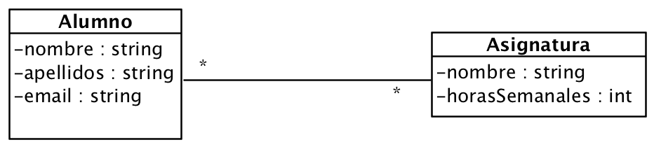

# Ejercicio 8 - Alumnos y asignaturas

Queremos construir una aplicación que permita almacenar la información relevante sobre alumnos y las asignaturas en las que están matriculados, tal como aparecen en el siguiente diagrama de clases:

El programa usará un interfaz gráfico creado en Swing y podrá realizar las siguientes acciones:

1. Crear nuevo alumno.
2. Crear nueva asignatura.
3. Matricular alumno en asignatura.
4. Listado de alumnos matriculados en una asignatura.
5. Listado de asignaturas en las que está matriculado un alumno y total de horas.
6. Salir

> NOTA: No hay límite en el número de alumnos y asignaturas que podemos almacenar.

> Opcional: Almacenar los datos en una base de datos SQLite.
